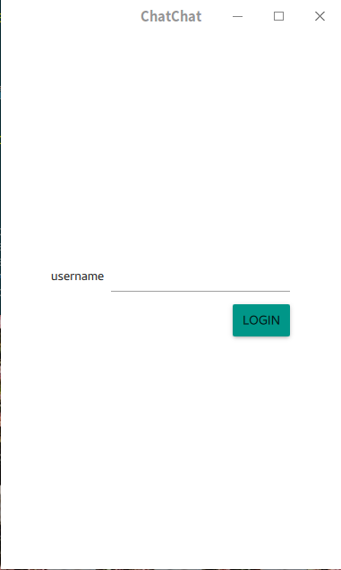
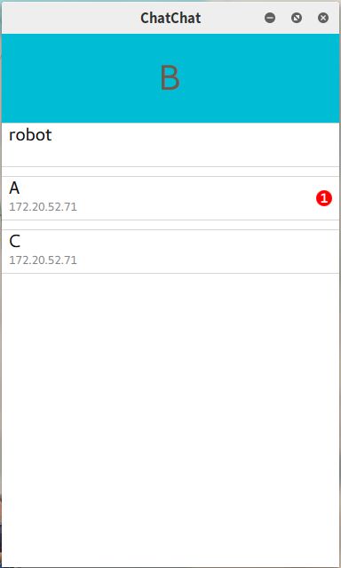
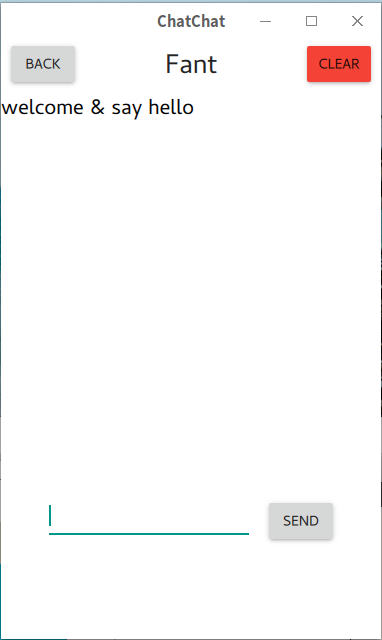
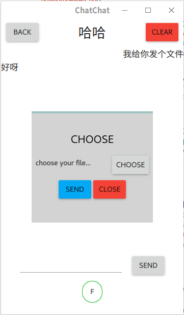

# 1. ChatChat
> 局域网一对一即时通信软件，大四网络课程设计

## 1.1. 环境
- Ubuntu 16.04
- Qt 5.9.1 (GCC 5.3.1 20160406 (Red Hat 5.3.1-6), 64 bit)
- Qt Creator 4.3.1

## 1.2. 主要技术
- qt quick
    - 多界面切换
- c++与qml混合编程
- socket编程

## 1.3 项目预览

### 登录

### 登录成功后

### 聊天

### 发送文件

### 机器人
